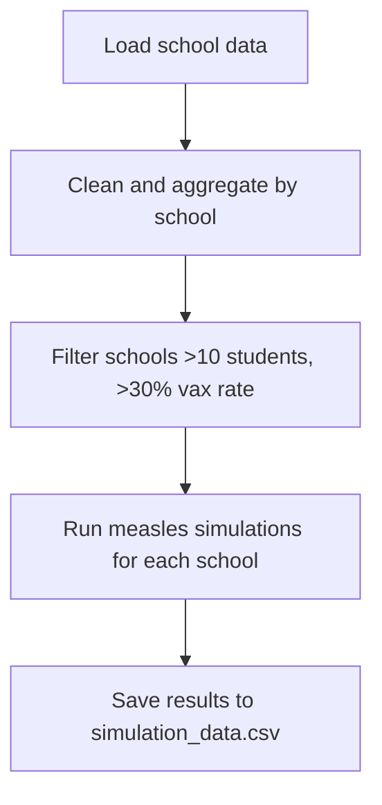
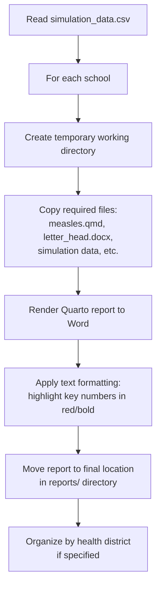

[](https://github.com/EpiForeSITE/measles-school-letters/actions/workflows/test-simulation.yml)

# Measles School Simulation Template[^original]

[^original]: This template is based on the original joint work by the Utah Department of Health and the University of Utah with support from the CDC.

> [!CAUTION]
> The code and model are still under development. We would love to hear your feedback and suggestions. Please open an issue in the [GitHub repository](https://github.com/EpiForeSITE/measles-school-letters) if you have any questions or suggestions.

This repository contains a template for conducting measles outbreak scenario modeling for schools. The code provides tools to simulate disease spread under different vaccination rates and intervention scenarios.

## Getting Started

### For Testing/Demonstration (Using Synthetic Data)

To test the repository with synthetic data:

```bash
TEST_DATA=TRUE make sims
TEST_DATA=TRUE make reports
```

This uses the included `test_school_vax_data.csv` with 3 synthetic schools (~500 students each, 80% vaccination rate).

### For Production Use

1. **Replace data file**: Create `school_vax_data.csv` with your actual school vaccination data (see format requirements below)

2. **Replace letterhead**: Replace `letter_head.docx` with your organization's letterhead template

3. **Run the simulation and report generation**:

    ```bash
    make sims
    make reports
    ```

    Or manually run the scripts in sequence:

    ```bash
    R CMD BATCH 00-simulation_data.R 00-simulation_data.Rout
    R CMD BATCH 01-generate_reports.R 01-generate_reports.Rout
    ```

For testing with synthetic data, you can set the environment variable `TEST_DATA=TRUE`:

```bash
TEST_DATA=TRUE make sims
TEST_DATA=TRUE make reports
```

### Required Data Format

Your production CSV file must be named `school_vax_data.csv` and contain these columns:
- `SchoolID`: Unique identifier for the school
- `Name`: School name
- `enrolled_students`: Total number of enrolled students
- `Students up to date with MMR`: Number of students with up-to-date MMR vaccination
- `Grade_level`: Grade level (Elementary, Middle, High, or School for mixed)
- `school_district`: Name of the school district
- `Health District`: Name of the health district
- `PUBLIC/PRIVATE`: School type
- `Chartered?`: Whether school is chartered (Yes/No)
- `inperson/online`: Learning mode ("In person or hybrid" for in-person schools)
- `Address`, `City`, `Zip Code`, `County`: Location information
- `r_school_code`: School code for reference

**Note**: The file can include comments (lines starting with `#`) which will be ignored when loaded into R.

### Required Template File

Your production letterhead template must be named `letter_head.docx` and should contain your organization's official letterhead formatting.

## Repository Structure

### Main Scripts
- [`00-simulation_data.R`](00-simulation_data.R) - **Main simulation script**. Runs the measles outbreak simulations for each school and saves results. **Run this script first.**
  - Uses [`params.yaml`](params.yaml) - Model parameters for the simulations
  - Reads either `school_vax_data.csv` (production) or `test_school_vax_data.csv` (testing) based on `TEST_DATA` environment variable
  - Generates [`simulation_data.csv`](simulation_data.csv) - Simulation results in CSV format
  - Generates [`simulation_data.rds`](simulation_data.rds) - Same results in R data format

- [`01-generate_reports.R`](01-generate_reports.R) - **Report generation script**. Creates individual Word document reports for each school. **Run this after generating simulation data.**
  - Uses [`measles.qmd`](measles.qmd) - Quarto template for generating reports
  - Uses [`letter_head.docx`](letter_head.docx) - Word template with your organization's letterhead
  - Outputs reports to [`reports/`](reports/) directory, organized by health district

- [`02-split_simulated_LHD.R`](02-split_simulated_LHD.R) - **Optional utility script**. Splits simulation data by health district and saves as separate CSV files

### Required Input Files

- **`school_vax_data.csv`** - Your school vaccination data (production use)
- **`test_school_vax_data.csv`** - Synthetic test data with 3 schools (included for testing)
- **`letter_head.docx`** - Your organization's letterhead template (replace for production use)

### Supporting Files

- [`scripts/`](scripts/) - Supporting R functions
  - [`scripts/model_functions.R`](scripts/model_functions.R) - Core epidemiological model functions
  - [`scripts/docx_edit.R`](scripts/docx_edit.R) - Functions to edit Word documents and highlight key statistics in red and bold

- [`reports/`](reports/) - Output directory for generated reports (see [reports/README.md](reports/README.md) for details)

- [`Makefile`](Makefile) - Build automation with targets: `sims`, `reports`, `clean_reports`, `clean_sims`, `clean_all`

## How the System Works

### 1. Data Loading and Environment Detection

The system automatically detects whether to use test or production data:

- **Test mode**: When `TEST_DATA=TRUE`, uses `test_school_vax_data.csv` (3 synthetic schools)
- **Production mode**: When `TEST_DATA` is unset or `FALSE`, uses `school_vax_data.csv` (your real data)

### 2. Simulation Process



The simulation runs multiple scenarios for each school:
- **Without quarantine**: Natural outbreak progression
- **With quarantine**: 21-day quarantine for unvaccinated exposed students

### 3. Report Generation Process



### 4. Output Organization

Reports are saved in the `reports/` directory:
- **With health districts**: `reports/{health_district_name}/{school_id}.docx`
- **Without health districts**: `reports/{school_id}.docx`

## Simulation Data Output Format

The `simulation_data.csv` file contains all the data needed to generate reports. Each row represents one school with the following columns:

- `id`: School identifier (format: `{SchoolID}_{r_school_code}_{Grade_level}`)
- `name`: School name
- `health_district`: Health district name (used for report organization)
- `letter_head`: Letterhead template filename (currently not used - defaults to `letter_head.docx`)
- `vax_rate`: Vaccination rate (0-1 scale)
- `pop_size`: School population size
- `no_quarantine_mean_cases`: Average number of cases without quarantine intervention
- `no_quarantine_mean_hosp`: Average number of hospitalizations without quarantine
- `quarantine_mean_cases`: Average number of cases with quarantine intervention  
- `quarantine_mean_hosp`: Average number of hospitalizations with quarantine

## Available Make Targets

Use these commands for common tasks:

- `make sims` - Generate simulation data
- `make reports` - Generate Word document reports
- `make clean_reports` - Remove all generated reports
- `make clean_sims` - Remove simulation data files
- `make clean_all` - Remove all generated files
- `make help` - Show available targets

## Testing and CI

The repository includes GitHub Actions CI that:
1. Tests simulation data generation with synthetic data (`TEST_DATA=TRUE`)
2. Validates report generation process
3. Ensures all outputs are created successfully

The CI uses a Docker container with R and required packages, demonstrating the complete workflow from data input to final reports.


## Acknowledgements

This was made possible by cooperative agreement CDC-RFA-FT-23-0069 from the CDC’s Center for Forecasting and Outbreak Analytics. Its contents are solely the responsibility of the authors and do not necessarily represent the official views of the Centers for Disease Control and Prevention.