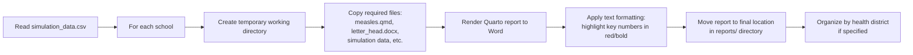

# Technical Details

This document provides technical details about the Measles School Simulation Template workflow, data processing, and implementation.

## Data Format Specifications

### Required Input Data Format

Your production CSV file must be named `school_vax_data.csv` and contain these required columns:

- `school_name`: Name of the school
- `school_id`: Unique identifier for the school
- `vax_rate`: Vaccination rate (decimal between 0 and 1, e.g., 0.85 for 85%)
- `pop_size`: Total number of students in the school

Optional columns:
- `group`: Group or district name (used to organize reports into subdirectories)
- `template_path`: Path to a custom Word template letterhead (defaults to `letter_head.docx` if not provided)

**Example CSV format:**
```csv
school_name,school_id,vax_rate,pop_size,group
Lincoln Elementary,SCH001,0.85,450,North District
Jefferson Middle School,SCH002,0.78,520,South District
Washington High,SCH003,0.92,680,North District
```

**Note**: The file can include comments (lines starting with `#`) which will be ignored when loaded into R.

### Simulation Output Data Format

The `simulation_data.csv` file contains all the data needed to generate reports. Each row represents one school with the following columns:

- `id`: School identifier (from the `school_id` column in input data)
- `name`: School name
- `group`: Group or district name (used for organizing reports into subdirectories)
- `template_path`: Path to Word template letterhead
- `vax_rate`: Vaccination rate (0-1 scale)
- `pop_size`: School population size
- `no_quarantine_mean_cases`: Average number of cases without quarantine intervention
- `no_quarantine_mean_hosp`: Average number of hospitalizations without quarantine
- `quarantine_mean_cases`: Average number of cases with quarantine intervention  
- `quarantine_mean_hosp`: Average number of hospitalizations with quarantine

## Details of the Workflow

### 1. Data Loading and Environment Detection

The system automatically detects whether to use test or production data:

- **Test mode**: When `TEST_DATA=TRUE`, uses `test_school_vax_data.csv` (3 synthetic schools)
- **Production mode**: When `TEST_DATA` is unset or `FALSE`, uses `school_vax_data.csv` (your real data)

The input data must contain these required columns:
- `school_name`: School name
- `school_id`: Unique identifier
- `vax_rate`: Vaccination rate (0-1)
- `pop_size`: Number of students

And optionally:
- `group`: For organizing reports by district/group
- `template_path`: Custom letterhead template

### 2. Simulation Process


#### Simulation Details

The simulation runs multiple scenarios for each school:
- **Without quarantine**: Natural outbreak progression
- **With quarantine**: 21-day quarantine for unvaccinated exposed students

#### Model Parameters

Each simulation uses parameters from `params.yaml`:
- Population size and vaccination rates (school-specific)
- Transmission parameters (contact rate, transmission probability)
- Disease progression parameters (incubation, prodromal, rash periods)
- Intervention parameters (quarantine compliance, isolation periods)
- Hospitalization parameters (rate, duration)

#### Parallel Processing

The simulation supports parallel processing:
- Uses `slurmR` package when available (for HPC environments)
- Falls back to standard `lapply` for local execution
- Configurable number of threads via parameters

### 3. Report Generation Process



#### Report Processing Details

1. **Template Processing**: Each school gets its own temporary directory with copied template files
2. **Parameter Substitution**: School-specific data is injected into the Quarto template
3. **Document Rendering**: Quarto renders the template to a Word document
4. **Post-processing**: Key statistics are highlighted in red and bold for emphasis
5. **Organization**: Reports are organized by health district (if specified) or placed in the root reports directory

### Output Organization

Reports are saved in the `reports/` directory:
- **With groups/districts**: `reports/{group_name}/{school_id}.docx`
- **Without groups**: `reports/{school_id}.docx`

### 5. Script Descriptions

#### Main Scripts

- **`00-simulation_data.R`** - Main simulation script that:
  - Loads and validates school vaccination data
  - Ensures required columns are present (school_name, school_id, vax_rate, pop_size)
  - Handles optional columns (group, template_path)
  - Runs measles outbreak simulations for each school
  - Handles both test data (synthetic) and production data
  - Supports parallel processing for large datasets
  - Outputs results in both CSV and RDS formats

- **`01-generate_reports.R`** - Report generation script that:
  - Reads simulation results from CSV files
  - Creates individual Word document reports for each school
  - Uses Quarto templates with school-specific parameter injection
  - Applies formatting to highlight key statistics
  - Organizes reports by group/district when specified (using the `group` column)
  - Supports custom letterhead templates via the `template_path` column
  - Handles both test and production data scenarios

- **`02-split_simulated_LHD.R`** - Optional utility script that:
  - Splits combined simulation data by group/district (using the `group` column)
  - Creates separate CSV files for each group
  - Useful for distributing results to different jurisdictions
  - Note: For more advanced district-level features, see v1.0 release

#### Supporting Scripts

- **`scripts/model_functions.R`** - Core epidemiological modeling functions:
  - `model_builder()`: Configures epiworldR measles models
  - `shiny_measles()`: Orchestrates complete simulation workflow
  - Helper functions for data processing and statistical analysis
  - Functions for calculating outbreak probabilities and hospitalization statistics

- **`scripts/docx_edit.R`** - Document post-processing functions:
  - Functions to modify Word documents after Quarto rendering
  - Text formatting to highlight key statistics in red and bold
  - Integration with the report generation workflow

### 6. Configuration Files

- **`params.yaml`** - Central configuration for model parameters
- **`measles.qmd`** - Quarto template for report generation
- **`letter_head.docx`** - Word template with organization letterhead
- **`Makefile`** - Build automation for common workflows

## Development and Testing

### Test Data
The repository includes `test_school_vax_data.csv` with synthetic data for 3 schools (~500 students each, 80% vaccination rate) to enable testing without real data.

### Continuous Integration
GitHub Actions CI automatically tests:
1. Simulation data generation with synthetic data
2. Report generation process
3. Output file validation
4. Complete workflow from input to final reports

### Error Handling
- Graceful fallbacks for missing optional dependencies
- Comprehensive logging for debugging
- Validation of input data formats
- Safe handling of temporary files and directories